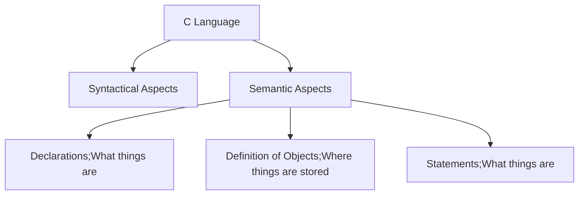

> Books Used: Modern C (Jens Gustedt)
>

**Note**: Although C and C++ appears to be the almost the same language, C++ being treated as a sister language from C, which historically is true, but they had separated from their common ancestors long before, therefore each languages are treated separately and these languages exchange their features in developing newer versions/ ISO standards. 
### The C language.
**C** is although is a multi-paradigm language (being able to express imperative and declarative languages) but C mostly is an imperative language i.e. with the help of an English dialect called the *C Jargon* we give our computer tasks to perform, step by step, instead of declaring something. (*Imperative* mood in English is to order or give instructions to someone. 

> **C is a compiled language**

Any human language cannot be directly read and translated into instructions by the computer, therefore a compiler turns the human language (any programming language like C etc. ) to **Binary** or **Executable** form which can be directly understood by the computer. 

Each executable required by any computer system, platform is different as different devices have different architecture and needs. C provides us with a level of abstraction over the machine-specific language (called the **assembler** or the **assembly language** ) so that anyone can write a code in C that could be run on every device

> **Any correctly written C code is portable to other devices**
> **A C program should be compiled cleanly without much warnings or any warnings at all**

#### Principle Structure of a Program

C language is composed of two aspects, the syntactical which is how to use the C Jargon which is basically the C grammar, and then the semantical aspects which tells us what do we specify so that it does what we want the program to do. 
###### Grammar (Lexical(Smallest Unit) elements)
**Special reserved words/ *Keywords*:** Words like include `#include, void, int, main` are immutable, therefore these can not be changed or used for some other purpose. These are the lexical elements or the smallest unit of the C Language.
Punctuation Characters: 
- Different type of brackets are used like `<...>,(...),{...},[...],/*..../*` . These all brackets occur in pairs, and the least used one is the `<...>` which can only span one line, unlike the other which can span multiple lines of text inside it. 
- Separator and Terminators are denoted by`,` and `;`, the comma used to separate objects/entities and the semicolon used to terminate what will be called  **Statement** 
- `/*.../* and //` are used as comments which are completely ignored by the compiler, used to explain the function of the code block, the first one spanning multiple lines of text, meanwhile the second one which is called the C++ style comment only spanning till the end of the line and behind the newline `\n`
- These punctuation characters can be used with different meaning, for example `{}` used to wrap a code block but also the syntax to declare an **Array**
Literals:
- Fixed value/constants in the code which are fixed/immutable.
- e.g. `1,2,3.43,"string literal","string %g nigga:"` are literals
- String literals are fixed strings along with formatting(escape characters, %g etc.)
Identifiers:
- Concept is of the "names" given by the user or natively provided by the ISO C standard to objects/entities. 
- These objcets can by **functions**, **variables**, **data type**, **constants** etc.
- As per the ISO standard: 
	- **An identifier can denote:**
		— a standard attribute, an attribute prefix, or an attribute name; (In a structure or node)
		— an object;
		— a function; (e.g. `main`)
		— a tag or a member of a structure, union, or enumeration;
		— a typedef name;(e.g. `typedef struct{};Struct`)
		— a label name; (used for jumping to a code block)
		— a macro name; (e.g. `#define MAX_SIZE 100` , here MAX_SIZE being the identifier in the macro.)
		— or, a macro parameter.

Function:
- An object/entity that "does" something or produce something.
- e.g. `int main(){...}, void inputstd(Students arr[]){....}` here **main** and **inputstd** are the functions. 
- The declaration of any function is followed by a code block enclosed in `{..}`
Operators:
- Operators can be of many types; Namely **Unary, Binary** and **Ternary** working on one, two and three inputs respectively.
- Arithmetic, Relational, Logical, Bitwise etc. are the types of operators that C provides. 

##### Semantic Aspects
**Declarations**: All identifiers need to be declared.

ss
